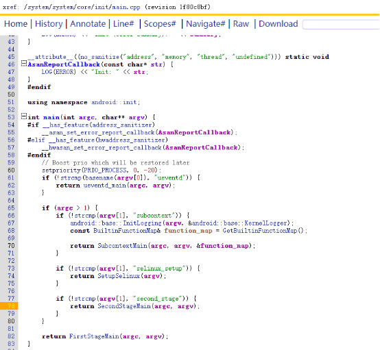
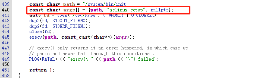
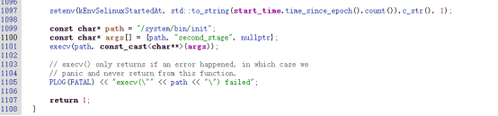
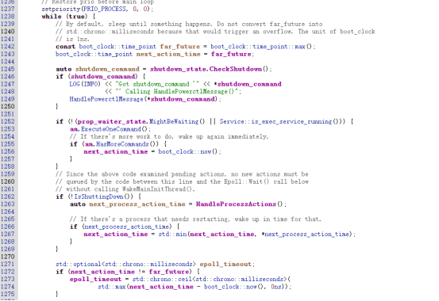
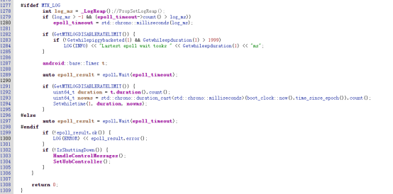

# 关机流程

Android的init 程序执行时不带参数，此时跑到FirstStageMain
在FirstStageMain最后会再次执行init，传入参数selinux_setup,这时会执行到SetupSelinux函数

SetupSelinux  函数最后就会执行SecondStageMain 函数

SecondStageMain 函数有一个死循环会不停监控系统是否接收到shutdown命令，如果有就去执行关机流程。

