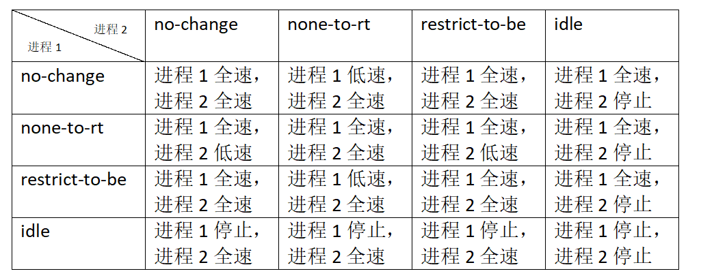

# 测试流程
像展锐这样新建一个foreground分组，系统里默认有一个background分组，默认分组的优先级都是No-change
`echo none-to-rt > /dev/blkio/foreground/blkio.prio.class`
这样可以把foreground改成 不同的优先级，再起2个fio

```Shell
/data/fio  -bs=4k -direct=1 -thread -rw=write -filename=/data/1 -name="BS 4KB read test" -iodepth=16 -size=4G
/data/fio  -bs=4k -direct=1 -thread -rw=write -filename=/data/2 -name="BS 4KB read test 1" -iodepth=16 -size=4G
```

通过ps查到fio的pid
分别加到不同分组

```Shell
echo fio1的pid > /dev/blkio/foreground/cgroup.procs
echo fio2的pid > /dev/blkio/background/cgroup.procs
```

再观察fio的速率变化

以下测试使用fio-3.35分别创建2个测试进程，对比不同IO优先级对进程IO的影响。
进程1进程2都是默认no-change

进程1设为idle,进程2设为 no-change

进程1设为none-to-rt，进程2 设为no-change

进程1设为restrict-to-be，进程2 设为no-change

进程1设为none-to-rt，进程2 设为restrict-to-be

进程1设为none-to-rt，进程2 设为idle

进程1设为 restrict-to-be，进程2 设为idle



