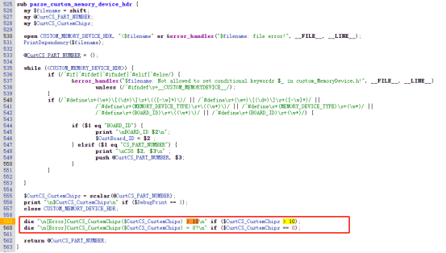

# MTK DDR时序合入注意事项
合入时需要注意某些平台有DDR数量的限制，在合入T302的DDR时序时编译报错了

[Error]CustCS_CustemChips(12) > 10
/home/android/work/code/T302AA_U_FTM/vendor/vendor/mediatek/proprietary/bootable/bootloader/preloader/custom/t302aa/inc/custom_MemoryDevice.h
/home/android/work/code/T302AA_U_FTM/vendor/vendor/mediatek/proprietary/bootable/bootloader/preloader/tools/emigen/MT6768/MemoryDeviceList_MT6768.xls
MT6768
/home/android/work/code/T302AA_U_FTM/vendor/out/target/product/t302aa/obj/PRELOADER_OBJ/inc
/home/android/work/code/T302AA_U_FTM/vendor/out/target/product/t302aa/obj/PRELOADER_OBJ/inc/custom_emi.h
/home/android/work/code/T302AA_U_FTM/vendor/out/target/product/t302aa/obj/PRELOADER_OBJ/inc/MTK_Loader_Info.tag

BOARD_ID MT6768_EVB

CS0 0, FLXC4003G_W7

CS0 1, BWMEXX32H2A_24Gb_X

CS0 2, FLXC4004G_W6

CS0 3, BWMZCX32H2A_32G_X

CS0 4, CXDB6CCDM_MA_M

CS0 5, H54G68CYRBX248N

CS0 6, CXDB5CCAM_MK

CS0 7, K4UHE3S4AA_MGCL

CS0 8, K4UBE3D4AB_MGCL

CS0 9, CXDBBCCBM_MK_B

CS0 10, RS768M32LX4D4BNR

CS0 11, RS1G32LX4D4BNR

12
make: *** [tools/emigen/emigen.mk:54: /home/android/work/code/T302AA_U_FTM/vendor/out/target/product/t302aa/obj/PRELOADER_OBJ/inc/custom_emi.h] Error 255

这里的报错主要是因为编译DDR时序代码时用的是Python脚本，会对DDR总数做判断：

合入DDR时序后无法刷机或开机

抓串口log，能开机的会打印
[DOE_ENV]get_env fullk

[MDL]index:0, MR5:FF, type:6, vender_id:13

[MDL]index:1, MR5:FF, type:6, vender_id:13

[MDL]index:2, MR5:FF, type:6, vender_id:13

[MDL]index:3, MR5:FF, type:6, vender_id:13

[MDL]index:4, MR5:13, type:6, vender_id:13

[MDL]index:5, MR5:6, type:6, vender_id:13

[MDL]index:6, MR5:13, type:6, vender_id:13

found:1,i:6

[EMI] MDL number = 6
