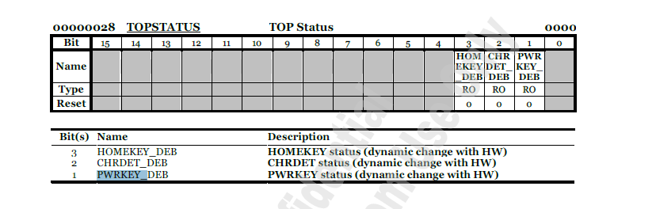
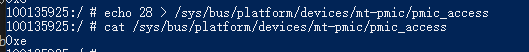

# MTK 按键失效问题分析

## kernel按键驱动分析

按键GPIO可以接 pmic的引脚或 普通GPIO，PWR key 和 HOME key 为PMIC引脚，使用的驱动是mtk_pmic_keys.c；如果是普通GPIO，使用驱动为mtk-kpd.c。一般硬件设计电源键接PMIC的PWRKEY，音量+接HOMEKEY，音量-使用普通GPIO。

### PMIC引脚的log

```txt
<6>[342670.129494][  T230] irq/287-mt6358-: mtk-pmic-keys mtk-pmic-keys: [name:mtk_pmic_keys&](pressed) key =116 using PMIC
<6>[342670.277062][  T230] irq/287-mt6358-: mtk-pmic-keys mtk-pmic-keys: [name:mtk_pmic_keys&]release key =116 using PMIC
<6>[342780.337075][T100230] irq/287-mt6358-: mtk-pmic-keys mtk-pmic-keys: [name:mtk_pmic_keys&](pressed) key =116 using PMIC
<6>[342780.493368][  T230] irq/287-mt6358-: mtk-pmic-keys mtk-pmic-keys: [name:mtk_pmic_keys&]release key =116 using PMIC

Line 132340: <3>[342671.299837][  T230] irq/287-mt6358-: [name:mtk_pmic_keys&]pmic volup key triggered, pressed is 1
Line 132348: <3>[342671.450395][T100230] irq/287-mt6358-: [name:mtk_pmic_keys&]pmic volup key triggered, pressed is 0
Line 132428: <3>[342678.437972][  T230] irq/287-mt6358-: [name:mtk_pmic_keys&]pmic volup key triggered, pressed is 1
Line 132437: <3>[342678.643431][  T230] irq/287-mt6358-: [name:mtk_pmic_keys&]pmic volup key triggered, pressed is 0
```

pmic 查看key 状态



查看0x28 寄存器的值,每次查看前都要先执行echo

echo 28 > /sys/bus/platform/devices/mt-pmic/pmic_access
cat /sys/bus/platform/devices/mt-pmic/pmic_access

按下音量+前的值：


按下后：


### 普通GPIO的log

```txt
<6>[342758.370552][    C0] swapper/0: [name:mtk_kpd&]kpd_volumedown_irq_handler:Enter!!
<6>[342758.370621][    C0] swapper/0: [name:mtk_kpd&]kpd_volumedown_irq_handler:vol_down_irq!!
<3>[342758.405703][    C0] swapper/0: [name:mtk_kpd&]kpd_set_volumedown_irq_type irq_type:1, val:0
<3>[342758.405846][    C0] swapper/0: [name:mtk_kpd&]kpd_volumedown_task_process vol_down val:0, last val:1
```

对应普通GPIO，可以通过命令查看GPIO状态，比如按键连接GPIO26
`adb shell 'grep 026 /proc/mtk_gpio/soc.pinctrl'`

### 上层获取按键事件

按键事件通过input子系统传到上层，kernel的按键中断处理程序会通过如下input接口发送input事件给上层应用

```C
input_report_key(info->keys->input_dev, info->keycode, 0);
input_sync(info->keys->input_dev);
```

Android上层收到input event后通过InputDispatcher处理。
相关log如下：

```log
main log:
08-06 15:00:54.718786  1917  2112 V InputDispatcher: dispatchKey - eventTime=343307253386000, deviceId=4, source=0x101, displayId=-1, policyFlags=0x62000000, action=0x0, flags=0x8, keyCode=0x18, scanCode=0x73, metaState=0x0, repeatCount=0, downTime=343307253386000
= 08-06 15:00:54.872625  1917  2112 V InputDispatcher: dispatchKey - eventTime=343307412360000, deviceId=4, source=0x101, displayId=-1, policyFlags=0x62000000, action=0x1, flags=0x8, keyCode=0x18, scanCode=0x73, metaState=0x0, repeatCount=0, downTime=343307253386000
08-06 15:05:10.966778  1917  2112 V InputDispatcher: dispatchKey - eventTime=343563505585000, deviceId=4, source=0x101, displayId=-1, policyFlags=0x62000000, action=0x0, flags=0x8, keyCode=0x18, scanCode=0x73, metaState=0x0, repeatCount=0, downTime=343563505585000
08-06 15:05:11.155495  1917  2112 V InputDispatcher: dispatchKey - eventTime=343563697157000, deviceId=4, source=0x101, displayId=-1, policyFlags=0x62000000, action=0x1, flags=0x8, keyCode=0x18, scanCode=0x73, metaState=0x0, repeatCount=0, downTime=343563505585000


08-06 15:00:54.711684  1917  2113 D PhoneWindowManagerExtImpl: interceptKeyBeforeQueueing:KeyEvent { action=ACTION_DOWN, keyCode=KEYCODE_VOLUME_UP, scanCode=115, metaState=0, flags=0x8, repeatCount=0, eventTime=343307253386000, downTime=343307253386000, deviceId=4, source=0x101, displayId=-1 },  keyguardOn = false,  screenOn = true,  policyFlags = 570425344,  SosPowerKeyEnabled = true,  WalletSwitchState = 2,  IsQuickLaunchSupport = false,  canceled = false
08-06 15:00:54.869798  1917  2113 D PhoneWindowManagerExtImpl: interceptKeyBeforeQueueing:KeyEvent { action=ACTION_UP, keyCode=KEYCODE_VOLUME_UP, scanCode=115, metaState=0, flags=0x8, repeatCount=0, eventTime=343307412360000, downTime=343307253386000, deviceId=4, source=0x101, displayId=-1 },  keyguardOn = false,  screenOn = true,  policyFlags = 570425344,  SosPowerKeyEnabled = true,  WalletSwitchState = 2,  IsQuickLaunchSupport = false,  canceled = false

sys log:
08-06 14:51:48.342267  1917  2113 I OplusKeyEventUtil: onKeyEvent, event: KeyEvent { action=ACTION_DOWN, keyCode=KEYCODE_VOLUME_UP, scanCode=115, metaState=0, flags=0x8, repeatCount=0, eventTime=342760883524000, downTime=342760883524000, deviceId=4, source=0x101, displayId=-1 }
08-06 14:51:48.343751  1917  2113 D StrategyBlackscreenshot: notifyKeyBeforeQueueing, event=KeyEvent { action=ACTION_DOWN, keyCode=KEYCODE_VOLUME_UP, scanCode=115, metaState=0, flags=0x8, repeatCount=0, eventTime=342760883524000, downTime=342760883524000, deviceId=4, source=0x101, displayId=-1 }, interactive=true
08-06 14:51:48.345056  1917  2113 D StrategyPadKeyBoardShortcut: notifyKeyBeforeQueueing, event=KeyEvent { action=ACTION_DOWN, keyCode=KEYCODE_VOLUME_UP, scanCode=115, metaState=0, flags=0x8, repeatCount=0, eventTime=342760883524000, downTime=342760883524000, deviceId=4, source=0x101, displayId=-1 }, interactive=true

```
