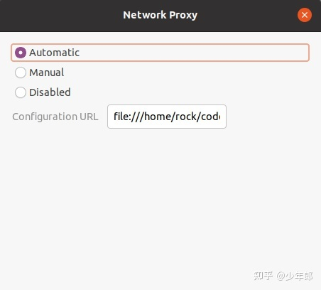

# ubuntu系统设置socks5和http代理

基本思路:

1. 安装和配置shaodowsocks代理
2. 系统上设置genpac实现自动代理
3. 使用Privoxy实现http代理

## 设置shadowsocks代理

安装shadowsocks客户端
`sudo apt-get install shadowsocks-libev`

编写json配置文件
`vim ~/shell/sha2.json`
内容如下:

```shell

{
    "server":"c92s1.jamjams3.net",
    "server_port":17517,
    "local_address": "127.0.0.1",
    "local_port":1080,
    "password":"KsFcGq7LZn66oky6",
    "timeout":300,
    "method":"aes-256-gcm",
    "fast_open":false
}
```

运行：
`ss-local -c ~/shell/sha2.json`

## 设置自动代理

为了方便上网，还需要安装genpac，这是一款基于 gfwlist 的多种代理软件配置文件生成工具。
首先，安装genpac

```Shell
sudo pip install genpac
sudo pip install --upgrade genpac
```

然后，使用genpac，生成PAC文件，文件保存位置没有限制

`sudo genpac --pac-proxy="SOCKS5 127.0.0.1:1080" -o “/home/ts/shell/autoproxy.pac” --gfwlist-url="https://pagure.io/gfwlist/raw/master/f/gfwlist.txt"`

最后，进入设置：Settings –> Network –> Network Proxy。方法选择 Automatic ，Configuration URL 填写刚刚生成的 pac 文件路径，格式如下：
`file:///home/ts/shell/autoproxy.pac`


## chrome使用代理

`/usr/bin/google-chrome-stable --proxy-server=socks5://127.0.0.1:1080`

## 设置http代理

参考:
[利用Privoxy设置终端http代理](利用Privoxy设置终端http代理🚀.mhtml)
