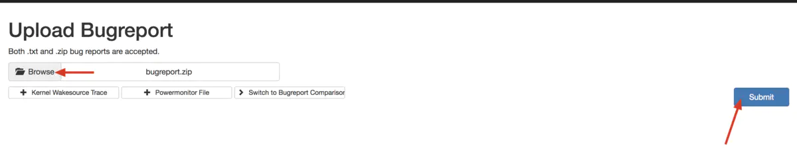
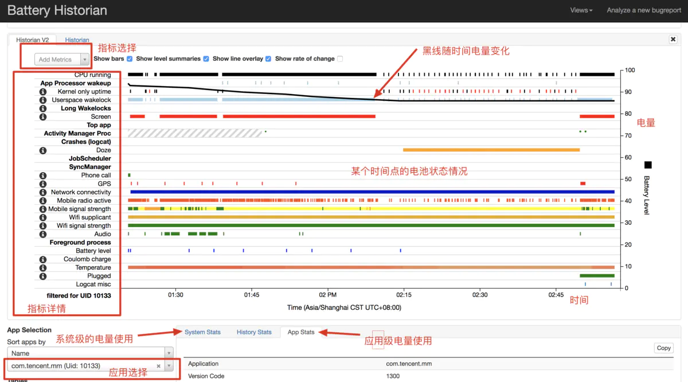

# 安装和使用battery-historian

2种方法：1是使用搭建好的docker镜像， 2是直接安装battery-historian

## 使用docker镜像

1. 安装docker

2. 执行`docker run -it -d -p 9999:9999 runcare/battery-historian --port 9999`,第一次会下载docker 镜像比较慢，以后也是每次执行这条命令。

## 安装battery-historian

1.安装golang
`sudo apt-get install golang`

2.设置环境变量 `export GOPATH=/home/ts/bin/go/go`,添加到~/.bashrc

3.执行：`cd $GOPATH //进入到home/go/go目录下`，下载battery-historian源码和编译用到的第三方库

```Shell
    go get -u github.com/golang/protobuf/proto
    go get -u github.com/golang/protobuf/protoc-gen-go
    go get -u github.com/google/battery-historian/...
```

4.进入`src/github.com/google/battery-historian`，修改battery-historian代码解决Q版本后无法解析问题

```diff
diff --git a/checkinparse/checkin_parse.go b/checkinparse/checkin_parse.go
index d8d6fcb..4519281 100644
--- a/checkinparse/checkin_parse.go
+++ b/checkinparse/checkin_parse.go
@@ -1979,7 +1979,7 @@ func parseAppWifi(record []string, app *bspb.BatteryStats_App) (string, []error)
 //
 // format: <idle_time>, <rx_time>, <power_ma_ms>, tx_time...
 func parseControllerData(pc checkinutil.Counter, section string, record []string) (*bspb.BatteryStats_ControllerActivity, error) {
-       var idle, rx, pwr int64
+       var idle, rx, pwr float64
        rem, err := parseSlice(pc, section, record, &idle, &rx, &pwr)
        if err != nil {
                return nil, err
@@ -1988,12 +1988,12 @@ func parseControllerData(pc checkinutil.Counter, section string, record []string
                return nil, fmt.Errorf(`%s didn't contain any transmit level data: "%v"`, section, record)
        }
        c := &bspb.BatteryStats_ControllerActivity{
-               IdleTimeMsec: proto.Int64(idle),
-               RxTimeMsec:   proto.Int64(rx),
-               PowerMah:     proto.Int64(pwr),
+               IdleTimeMsec: proto.Int64(int64(idle)),
+               RxTimeMsec:   proto.Int64(int64(rx)),
+               PowerMah:     proto.Int64(int64(pwr)),
        }
        for i, t := range rem {
-               tm, err := strconv.Atoi(t)
+               tm, err := strconv.ParseFloat(t, 64)
                if err != nil {
                        return nil, fmt.Errorf("%s contained invalid transmit value: %v", section, err)
                }
diff --git a/packageutils/packageutils.go b/packageutils/packageutils.go
index 709274c..32ad7c2 100644
--- a/packageutils/packageutils.go
+++ b/packageutils/packageutils.go
@@ -51,7 +51,7 @@ const (
 )
 
 // abrUIDRE is a regular expression to match an abbreviated uid (ie u0a2). Based on the format printed in frameworks/base/core/java/android/os/UserHandle.java
-var abrUIDRE = regexp.MustCompile("u(?P<userId>\\d+)(?P<aidType>[ias])(?P<appId>\\d+)")
+var abrUIDRE = regexp.MustCompile("u(?P<userId>\\d+)(?P<aidType>[ias]+)(?P<appId>\\d+)")
 
 // This list is not comprehensive but it will cover the most common cases. The list was curated
 // from the output of running both 'adb shell dumpsys activity providers' and

```

5.编译battery-historian，会下载一些库，这里会报很多错误，下面一条解决库错误

`go run setup.go`

6.解决三方库错误，再次编译成功

```Shell
cd third_party/closure-library/
git reset --hard v20170409
cd -
go run setup.go
```

7.运行battery-historian

`go run cmd/battery-historian/battery-historian.go   //运行服务器端程序，以本机作为服务器，端口号默认为9999：`

这时候打开浏览器里面输入127.0.0.1:9999(或者localhost:9999)会出现界面

## battery-historian的使用

### 获取设备的耗电报告

要从运行Android 7.0和更高版本的开发设备获取错误报告:

`adb bugreport`

选择bugreport.zip文件上传


之后就会看到电池的使用数据报告，Battery Historian图表显示随着时间的推移电源相关事件。

当系统组件处于活动状态时，每行显示彩色条形段，从而从电池中汲取电流。该图表并未显示该组件使用了多少电，只是该应用程序处于活动状态。图表按类别进行组织，随着时间的推移显示每个类别的栏，如图表的X轴上所示。不同颜色代表指标的不同状态：比如Screen 红色代表亮屏，白色代表关屏，具体鼠标放在最左侧的️上就会自动提示


默认情况下，统计信息是在运行基础上维护的，Android也不记录特定于应用程序的用户空间wakelock转换的时间戳。如果您希望Historian在时间线上显示关于每个单独唤醒锁的详细信息，则应在开始实验之前使用以下命令启用完整唤醒锁报告：

`adb shell dumpsys batterystats --enable full-wake-history`

请注意，通过启用完全唤醒锁定报告，电池历史记录将在几个小时内溢出。使用此选项进行短时间测试（3-4小时）。

采集报告前将battery统计状态重置，重置命令结束后断开usb，测试结束后用获取报告命令导出统计文件包：

`adb shell dumpsys batterystats --reset`
