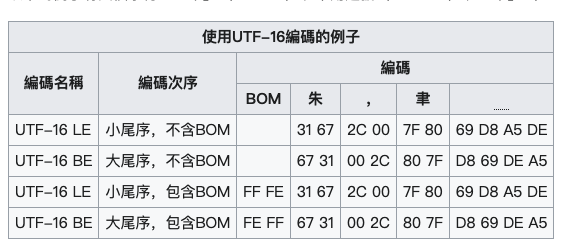

## 计算机是如何表示字符的
    计算机中使用十六进制对字符进行编码，程序设计中最常用的编码是Ascii。它是对英语中的字母，符号和计算机控制符的8位编码

## 常用的编码
    英语：          Ascii
    中国：          GB2312
    台湾繁体：       BIG5
    世界通用的编码： UTF8、UTF16 LE、  UTF16 BE

## 各种编码的格式
### Ascii:
#### 7 位代码
```
主条目：ISO/IEC 646和ITU T.50
另见：UTF-7
从早期的发展开始，[56] ASCII 旨在成为国际字符代码标准的几个国家变体之一。

其他国际标准机构已经批准了与 ASCII 相同或几乎相同的字符编码，例如ISO 646 (1967)，对英语字母表以外的字符和在美国以外使用的符号进行了扩展，例如英国英镑的符号（英镑）。几乎每个国家都需要 ASCII 的改编版本，因为 ASCII 只适合美国和其他一些国家的需要。例如，加拿大有自己的支持法语字符的版本。

许多其他国家/地区开发了 ASCII 的变体以包括非英语字母（例如é、ñ、ß、Ł）、货币符号（例如£、¥）等。另见YUSCII（南斯拉夫）。

它将共享大多数字符，但将其他本地有用的字符分配给为“国家使用”保留的几个代码点。然而，从 ASCII-1963 发布到 ISO 在 1967 年首次接受国际建议之间的四年[57]导致 ASCII 对国家使用字符的选择似乎是世界事实上的标准，造成混乱和不兼容一旦其他国家开始对这些代码点进行自己的分配。
```

#### 8 位代码
```
最终，随着 8 位、16位和32 位（以及后来的64 位）计算机开始取代12 位、18位和36 位计算机成为常态，使用 8 位字节来存储每个字节变得很普遍。字符，为 ASCII 的扩展 8 位亲属提供了机会。在大多数情况下，这些是作为 ASCII 的真正扩展而开发的，保留原始字符映射不变，但在前 128 个（即 7 位）字符后添加额外的字符定义。

编码包括ISCII（印度）、VISCII（越南）。尽管这些编码有时被称为 ASCII，但真正的 ASCII 仅由 ANSI 标准严格定义。

大多数早期的家用计算机系统都开发了自己的 8 位字符集，其中包含画线和游戏字形，并且经常用更多的图形填充从 0 到 31 的部分或全部控制字符。Kaypro CP/M计算机使用希腊字母表的“大写”128 个字符。
```

### GB232
```
    GB/T 2312[註 1]，GB/T 2312–80 或 GB/T 2312–1980 是中华人民共和国国家标准简体中文字符集，全称《信息交换用汉字编码字符集·基本集》，通常簡稱GB（「国标」汉语拼音首字母），又稱GB0，由中国国家标准总局於1980年发布，1981年5月1日实施。GB/T 2312编码通行于中国大陆；新加坡等地也采用此编码。中国大陆几乎所有的中文系统和国际化的软件都支持GB/T 2312。

    GB/T 2312标准共收录6763个汉字，其中一级汉字3755个，二级汉字3008个；同时收录了包括拉丁字母、希腊字母、日文平假名及片假名字母、俄语西里尔字母在内的682个字符。

GB/T 2312的出现，基本满足了汉字的计算机处理需要，它所收录的汉字已经覆盖中国大陆99.75%的使用频率。但对于人名、古汉语等方面出现的罕用字和繁體字，GB/T 2312不能处理，因此后来GBK及GB 18030汉字字符集相继出现以解決這些問題。

分区表示
GB/T 2312中对所收汉字进行了“分区”处理，每区含有94个汉字／符号，共计94个区。用所在的区和位来表示字符（实际上就是码位），因此称为区位码（或许叫“区位号”更为恰当）。表示方式也称为区位码。例如“万”字在45区82位，所以“万”字的区位码是：45 82（注意，GB类汉字编码为双字节编码，因此，45相当于高位字节，82相当于低位字节）。

01~09区（682个）：特殊符号、数字、英文字符、制表符等，包括拉丁字母、希腊字母、日文平假名及片假名字母、俄语西里尔字母等在内的682个全角字符；
10~15区：空区，留待扩展；在附录3，第10区推荐作为 GB 1988–80 中的94个图形字符区域（即第3区字符之半形版本）。
16~55区（3755个）：常用汉字（也称一级汉字），按拼音排序；
56~87区（3008个）：非常用汉字（也称二级汉字），按部首/笔画排序；
88~94区：空区，留待扩展。

国标码（交换码）
为了避开ASCII字符中的CR0不可显示字符（十六进制为0 ~ 1F，十进制为0 ~ 31）及空格字符0010 0000（十六进制为20，十进制为32），国标码（又称为交换码）规定表示汉字双字节编码范围为十六进制为（21，21） ~ （7E，7E），十进制为（33，33） ~ （126，126） 。因此，须将“区码”和“位码”分别加上32（十六进制为20H），作为国标码。以避免与ASCII字符中0~32的不可显示字符和空格字符相冲突。

例如： “万”字的国标码十进制为：（45+32，82+32） = （77，114），十六进制为：（4D，72H）。

内码（机内码）
国标码和通用的ASCII码冲突。把国标码中的每个字节的最高位都从0换成1，即相当于每个字节都再加上128（十六进制为80，即80H；二进制为1000 0000），从而得到国标码的“机内码”表示，简称“内码”。

字节结构
在使用GB/T 2312的程序通常采用EUC储存方法，以便兼容于ASCII。这种格式称为EUC-CN。浏览器编码表上的“GB2312”就是指这种表示法。

每个汉字及符号以两个字节来表示。第一个字节称为“高位字节”，第二个字节称为“低位字节”。

“高位字节”使用了0xA1–0xF7（把01–87区的区号加上0xA0），“低位字节”使用了0xA1–0xFE（把01–94加上0xA0）。 由于一级汉字从16区起始，汉字区的“高位字节”的范围是0xB0–0xF7，“低位字节”的范围是0xA1–0xFE，佔用的码位是72*94=6768。其中有5个空位是D7FA–D7FE。

例如“啊”字在大多数程序中，会以两个字节，0xB0（第一个字节）0xA1（第二个字节）储存。（与区位码对比：0xB0=0xA0+16,0xA1=0xA0+1）。
```

### UTF-8
```
UTF-8（8-bit Unicode Transformation Format）是一種針對Unicode的可變長度字元編碼，也是一种前缀码。它可以用一至四个字节对Unicode字符集中的所有有效编码点进行编码，属于Unicode标准的一部分，最初由肯·汤普逊和罗布·派克提出。[2][3]由于较小值的编码点一般使用频率较高，直接使用Unicode编码效率低下，大量浪费内存空间。UTF-8就是为了解决向后兼容ASCII码而设计，Unicode中前128个字符，使用与ASCII码相同的二进制值的单个字节进行编码，而且字面与ASCII码的字面一一对应，這使得原來處理ASCII字元的軟體無須或只須做少部份修改，即可繼續使用。因此，它逐漸成為電子郵件、網頁及其他儲存或傳送文字優先採用的編碼方式。
```


### UTF-16
```
Unicode的编码空间从U+0000到U+10FFFF，共有1,112,064个码位（code point）可用来映射字符。Unicode的编码空间可以划分为17个平面（plane），每个平面包含216（65,536）个码位。17个平面的码位可表示为从U+xx0000到U+xxFFFF，其中xx表示十六进制值从0016到1016，共计17个平面。第一个平面称为基本多语言平面（Basic Multilingual Plane, BMP），或稱第零平面（Plane 0），其他平面称为辅助平面（Supplementary Planes）。基本多语言平面內，從U+D800到U+DFFF之間的码位區段是永久保留不映射到Unicode字符。UTF-16就利用保留下来的0xD800-0xDFFF区段的码位來對輔助平面的字符的码位進行編碼。
```
#### UTF-16的編碼模式
```
UTF-16的大尾序和小尾序儲存形式都在用。一般來說，以Macintosh製作或儲存的文字使用大尾序格式，以Microsoft或Linux製作或儲存的文字使用小尾序格式。

為了弄清楚UTF-16文件的大小尾序，在UTF-16文件的開首，都會放置一個U+FEFF字符作為Byte Order Mark（UTF-16 LE以 FF FE 代表，UTF-16 BE以 FE FF 代表），以顯示這個文字檔案是以UTF-16編碼，其中U+FEFF字符在UNICODE中代表的意義是 ZERO WIDTH NO-BREAK SPACE，顧名思義，它是個沒有寬度也沒有斷字的空白。

以下的例子有四個字符：「朱」（U+6731）、半角逗號（U+002C）、「聿」（U+807F）、「𪚥」（U+2A6A5）。
```


## 字符编码和字体的对应关系
    每种字体都包含其支持的每个字符的字模文件（字符的点阵表示）。字体可能支持多种编码方式，所以每种编码的字符需要说明其与字模的对应关系。


## 在编程中规范字符编码
    编程中可能使用多种编码，为了编译器能兼容不同编码的代码文件，需要告诉编译器使用的输入和输出编码。

```c
//GCC中的编码选项
    //指定输出编码
        -fexec-charset=charset
                Set the execution character set, used for string and character constants.  The default is UTF-8.  charset can be any encoding
                supported by the system's "iconv" library routine.

       -fwide-exec-charset=charset
           Set the wide execution character set, used for wide string and character constants.  The default is UTF-32 or UTF-16, whichever
           corresponds to the width of "wchar_t".  As with -fexec-charset, charset can be any encoding supported by the system's "iconv"
           library routine; however, you will have problems with encodings that do not fit exactly in "wchar_t".
    //指定输入编码
       -finput-charset=charset
           Set the input character set, used for translation from the character set of the input file to the source character set used by
           GCC.  If the locale does not specify, or GCC cannot get this information from the locale, the default is UTF-8.  This can be
           overridden by either the locale or this command-line option.  Currently the command-line option takes precedence if there's a
           conflict.  charset can be any encoding supported by the system's "iconv" library routine.
```

